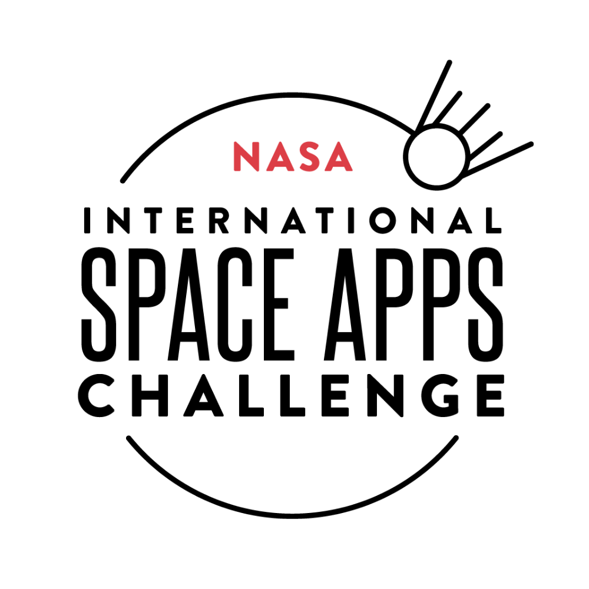

# 🚀 Interstellar Automated Visualizer (IAV)

  

A **scalable visualization platform** for biological experiments conducted in space, built for the **2024 NASA Space Apps Challenge**.  
Focused on datasets **OSD-379** and **OSD-665**, the tool ingests metadata from NASA’s Open Science Data Repository (OSDR), generates **interactive experiment visualizations**, and provides context through a built-in chatbot.

---

## 🌍 Recognition
Our project was selected as a **Global Finalist** in the **2024 NASA Space Apps Challenge**, ranking among the top projects worldwide.  

🔗 [Official Project Page](https://www.spaceappschallenge.org/nasa-space-apps-2024/find-a-team/space-meatballs/?tab=details)  
🎥 [Demo Video](https://www.youtube.com/watch?v=TrJgYYgM3ps)  

---

## ✨ Features

- **Dynamic Data Ingestion**: Automatically parses OSDR datasets (e.g., OSD-379, OSD-665) for analysis.  
- **Interactive Dashboards**: Explore timelines, treatment groups, and sample structures via a **tree-like experiment visualizer**.  
- **Filter & Drill-Down**: Zoom, restructure experiments by factor values, and compare groups side-by-side.  
- **Results Pop-Ups**: Correlation heatmaps, parameter distributions, mean values, and sample breakdowns.  
- **Contextual Side Panel**: Quick access to experiment metadata, links to NASA/Wikipedia, and sample characteristics.  
- **IAV Bot**: A built-in chatbot that answers experiment-related questions and guides users through the tool.  

---

## 🛠️ Technologies

- **Frontend**: React, JavaScript, CSS  
- **Backend**: Python, FastAPI  
- **Visualization**: Plotly, Dash, D3.js  
- **AI & Interactivity**: LangChain, OpenAI API, Chatbot Kit  
- **Data**: NASA OSDR datasets (OSD-379, OSD-665), Open Science Data Repository  

---

## 👥 Team
- Harlan  
- Andre  
- Johnpaul  
- Carol  
- Matthew  
- Kaan  
- Everest  

---

## 📌 Future Work

- Add support for more OSDR datasets.  
- Expand chatbot capabilities with deeper dataset Q&A.  
- Enhance styling and usability for broader adoption by researchers.  

---
